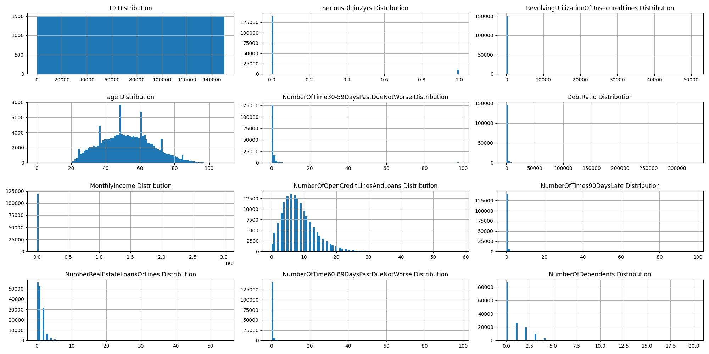
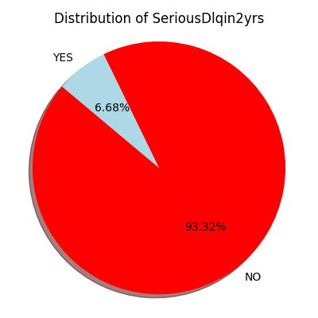
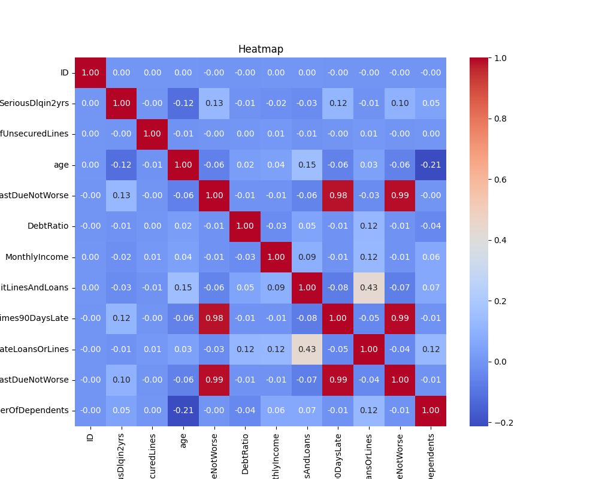
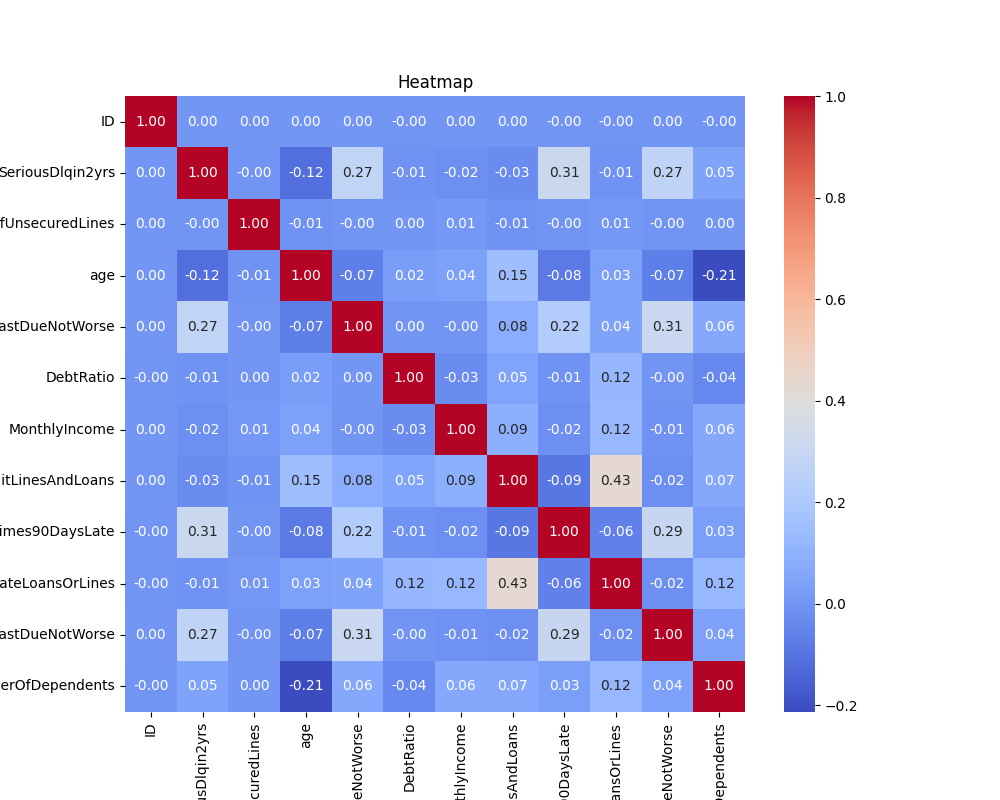
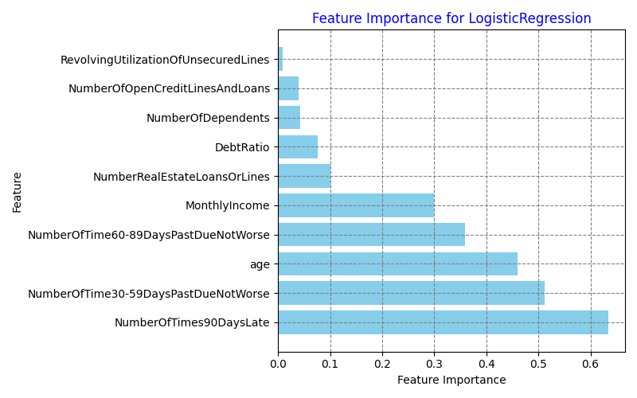
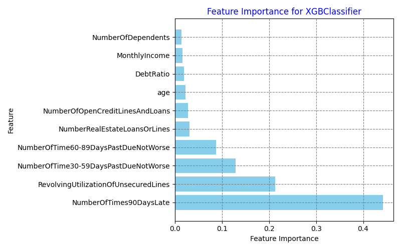
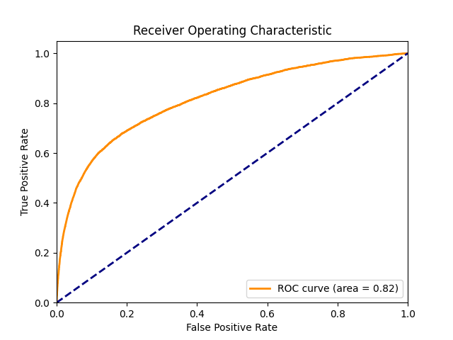
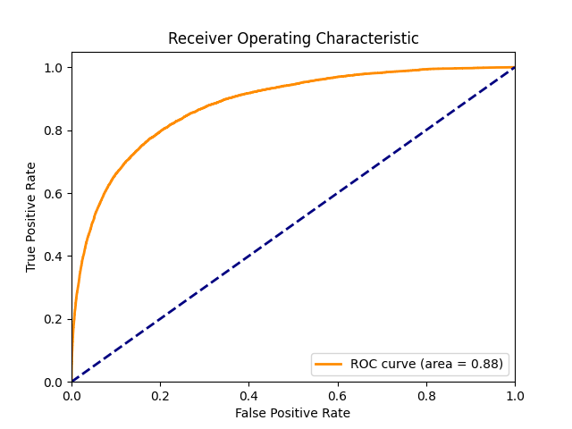
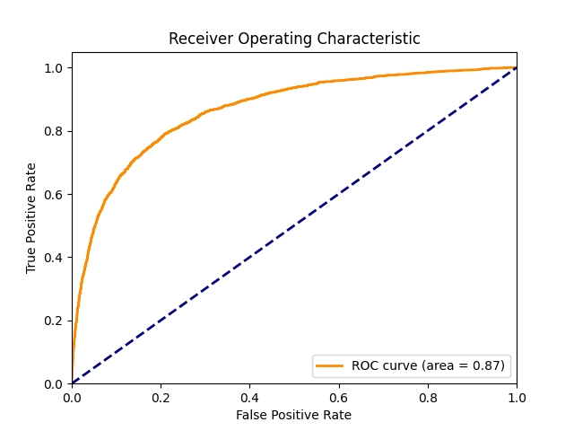

# Give Me Some Credit: Credit Default Prediction 📊

## Introduction 🚀

The "Give Me Some Credit" (GMSC) dataset from Kaggle is a well-known dataset used for predicting the probability that a borrower will default on their credit within 2 years. The dataset contains 11 features and approximately 250,000 anonymized borrower records. The primary goal is to predict the binary outcome of `SeriousDlqin2yrs`, which indicates whether a borrower has experienced 90 days past due delinquency or worse.

This notebook explores the dataset, performs data preprocessing, and applies various machine learning models to predict credit default. The models include Logistic Regression, Random Forest, XGBoost, and an Ensemble method using Stacking.

## Dataset Overview 📋

The dataset is split into a training set with 150,000 examples and a testing set with 101,503 examples. The training set contains 10,026 positive examples (default) and 139,974 negative examples (no default). The dataset includes the following features:

| Variable Name                        | Description                                                                 | Data Type |
|--------------------------------------|-----------------------------------------------------------------------------|-----------|
| SeriousDlqin2yrs                     | Person experienced 90 days past due delinquency or worse.                   | Y/N       |
| RevolvingUtilizationOfUnsecuredLines | Total balance on credit cards and personal lines of credit.                 | percentage|
| Age                                  | Age of borrower in years.                                                   | integer   |
| NumberOfTime30-59DaysPastDueNotWorse | Number of times borrower has been 30-59 days past due but no worse.         | integer   |
| DebtRatio                            | Monthly debt payments, alimony, living costs divided by monthly gross income.| percentage|
| MonthlyIncome                        | Monthly income.                                                             | real      |
| NumberOfOpenCreditLinesAndLoans      | Number of Open loans (installment like car loan or mortgage) and Lines of credit.| integer|
| NumberOfTimes90DaysLate              | Number of times borrower has been 90 days or more past due.                 | integer   |
| NumberRealEstateLoansOrLines         | Number of mortgage and real estate loans including home equity lines of credit.| integer|
| NumberOfTime60-89DaysPastDueNotWorse | Number of times borrower has been 60-89 days past due but no worse.         | integer   |
| NumberOfDependents                   | Number of dependents in family excluding themselves (spouse, children etc.).| integer   |

## Exploratory Data Analysis (EDA) 🔍

### Summary Statistics 📊

The dataset was analyzed to understand the distribution and summary statistics of each feature. Key observations include:

- **Class Imbalance**: The dataset is imbalanced with only 6.7% of the samples belonging to the positive class (default). 🤔
- **Outliers**: Certain features like `RevolvingUtilizationOfUnsecuredLines` and `DebtRatio` had extreme values that were addressed during preprocessing. 🚨
- **Missing Values**: Features like `MonthlyIncome` and `NumberOfDependents` had missing values that were imputed using median values. 🧩

### Data Preprocessing 🛠️

1. **Imputation**: Missing values in `MonthlyIncome` and `NumberOfDependents` were imputed using the median value. 🔄
2. **Outlier Handling**: Values of 96 and 98 in features like `NumberOfTime30-59DaysPastDueNotWorse`, `NumberOfTimes90DaysLate`, and `NumberOfTime60-89DaysPastDueNotWorse` were considered outliers and were replaced with the median value. 🔧
3. **Feature Scaling**: Features were scaled using StandardScaler to ensure uniformity. 📏

### Data Analysis Overview 📊

### Distribution of SeriousDlqin2yrs 📊

### Correlation Heatmap (Original Data) 📊

### Correlation Heatmap (96 and 98 Adjusted Data) 📊

## Model Training and Evaluation 🧠

The dataset was split into training and validation sets using a 2-fold cross-validation approach. Various models were trained and evaluated based on their AUC (Area Under the Curve) scores.

### Models Evaluated 📈

1. **Logistic Regression**:
   - AUC (Training): 0.8161
   - AUC (Validation): 0.8127

2. **Decision Tree**:
   - AUC (Training): 0.61
   - AUC (Validation): 0.6049

3. **Random Forest**:
   - AUC (Training): 0.8892
   - AUC (Validation): 0.8640

4. **Gradient Boosting**:
   - AUC (Training): 0.8779
   - AUC (Validation): 0.8645

5. **XGBoost**:
   - AUC (Training): 0.8798
   - AUC (Validation): 0.8656

6. **Stacking**:
   - AUC (Training): 0.8798
   - AUC (Validation): 0.8655

### Feature Importance 🔍

Feature importance was analyzed for each model to understand which features contributed most to the predictions. Key features included `RevolvingUtilizationOfUnsecuredLines`, `Age`, and `DebtRatio`.

#### Logistic Regression Feature Importance 📊

#### XGBoost Feature Importance 📊

### ROC Curves 📈

#### Logistic Regression ROC Curve 📊

#### XGBClassifier ROC Curve 📊

#### Stacking ROC Curve 📊

## Conclusion 🎉

XGBoost and Random Forest models performed the best, with XGBoost slightly outperforming Random Forest. Stacking models, although promising, did not show significant improvement over the individual models. The models were able to predict credit default with reasonable accuracy, which is crucial for financial institutions to manage risk effectively. 💪

## Future Work 🚀

- **Hyperparameter Tuning**: Further hyperparameter tuning could potentially improve model performance. 🛠️
- **Deep Learning**: Exploring deep learning models could provide additional insights and potentially better performance. 🧠
- **Ensemble Methods**: Combining the strengths of multiple models through ensemble techniques could be explored further. 🤝

## Requirements 📦

- Python (>3.4)
- Jupyter Notebook
- Scikit-Learn
- Pandas
- Numpy
- Matplotlib
- Seaborn
- XGBoost
---

Thank you for your interest in the project! If you have any questions or suggestions, feel free to reach out. 😊
